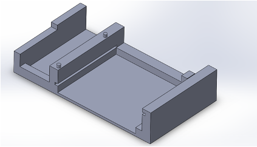
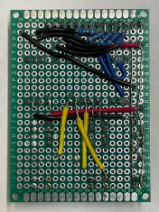
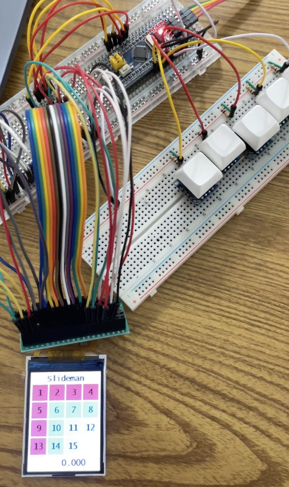
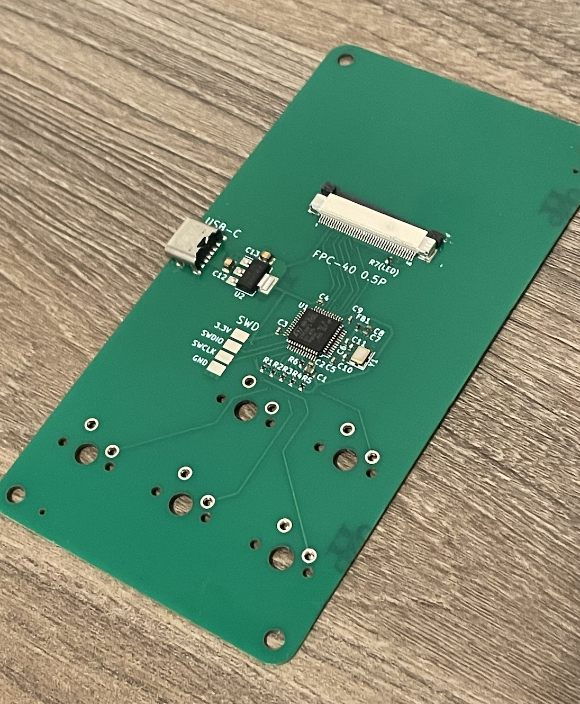
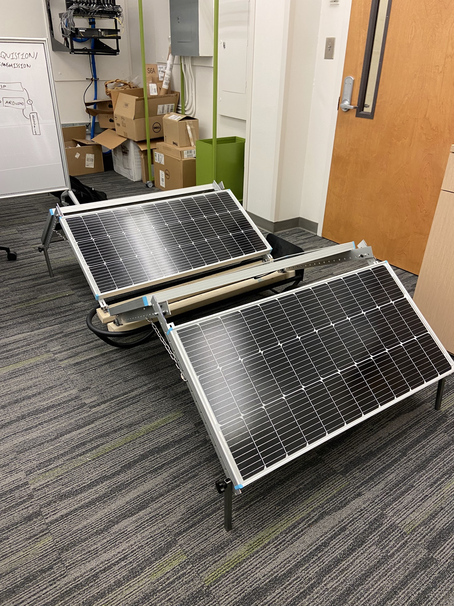
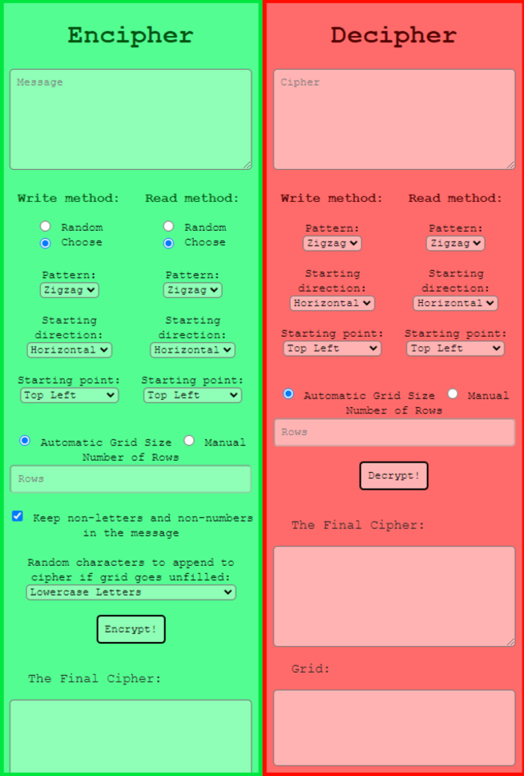

## Projects

| [Home](index.md) | [Projects](projects.md) | [Resumé](resume.md) | [Skills/Passions](skills.md) |

### Slideman -- Electronic 15-puzzle

I’ve been part of the niche speedsliding community, and all the good slide puzzles were only on computers, so I created a handheld slide puzzle, fixed with mechanical buttons for tactile feedback.​

In the span of the two weeks between my internship and the fall semester of school, I built the entire machine, having to learn how to solder electrical connections and design schematics based on part datasheets. Waiting for parts to be shipped, I programmed the puzzle from scratch, itching to debug the code when I could finally test it.

<video width="320" controls>
    <source src="images/slide.mp4" type="video/mp4">
</video>

With my knowledge of Solidworks and 3D printing, I designed a chassis with perfect tolerances to secure the circuit board in place and accommodate every feature of the final design.​

Finally, the project involved creating a non-Arduino implementation, which can be seen in the breadboard image. This involved learning C and the STM32CubeIDE to build the project, and installing and modifying drivers to run the display. What you see in the PCB image below is an STM32 processor unit, which I put on a custom board. This diverges from Arduino majorly. The code, IDE, and general development environment is what I'd use in a professional environment.

The schematic for the board was made painstakingly over hours using KiCAD. I created my own footprints, combed through datasheets, and cross-referenced parts on JLCPCB to ensure the board could be built by my manufacturer.

### Collapsible/Portable Solar Array

This project, done during Spring and Fall 2023, was done with a team of student engineers I recruited and directed so we could build a mechanical structure housing joints that allow the four 100-W solar panels to join together on a hand truck.

This project involved both mechanical and electrical design, as can be seen, which is part of my journey to have competence in electrical, software, and mechanical systems, because that's where the most progress can be made.

### Battery Temperature Data Collection

The problem I was faced with was getting several accurate temperature measurements on batteries simultaneously. The lab I worked in over Summer 2022 wanted to test the limits of battery cycling rates, but the data collection system had no way of gauging temperatures.​

I found thermocouple units online, and to organize them and the Arduino for temperature data collection, I designed in Solidworks a model, accounting for PCB tolerances, that could integrate the parts.​

The data collected from the Arduino was separate from the rest of the battery data, so I had to use Python to generate the desired data, merge the instances together, accounting for time mismatch, and get useful results by data visualization.​

### Andon Light Electronic Update System

In my internship last summer, one of the problems I realized existed on the factory floor was the lack of communication between floor workers and the floor leads. This would be made faster, enabling other improvements, if the Andon light colors were visible on lead computers and in real life as opposed to just real life. The only existing option were $375 ethernet-connected lights, so I created, using an Arduino Nano, a Python program that could intake a simple button click and send the signal to the Andon light, and wherever else the information needed to go - even across the entire factory.

<video width="500" controls>
    <source src="images/internship.mp4" type="video/mp4">
</video>

### Classic Ciphers (Python)

To improve my ability to program, I created a Caesar cipher in Python, a project which sparked, on top of creating 36 other classical ciphers, a failsafe user interface to navigate between all the ciphers and functions I created.​

Continuing the project, I added more functionalities like predicting the correct English decipherment when given a set of options. I wanted to better the UI and switched to creating an HTML layout, where I learned jQuery and CSS to make a more intuitive design.​

    

        
    

    

         <video width="500" controls>
            <source src="images/demo.mp4" type="video/mp4">
        </video>
    

 